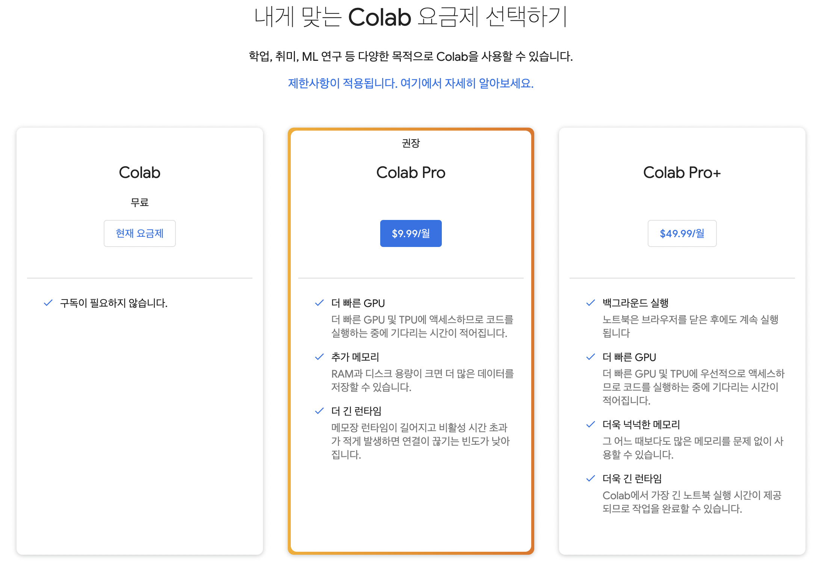
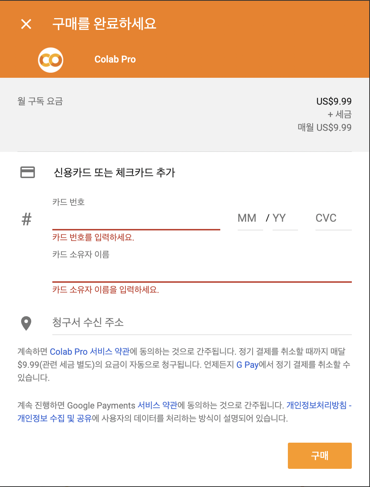
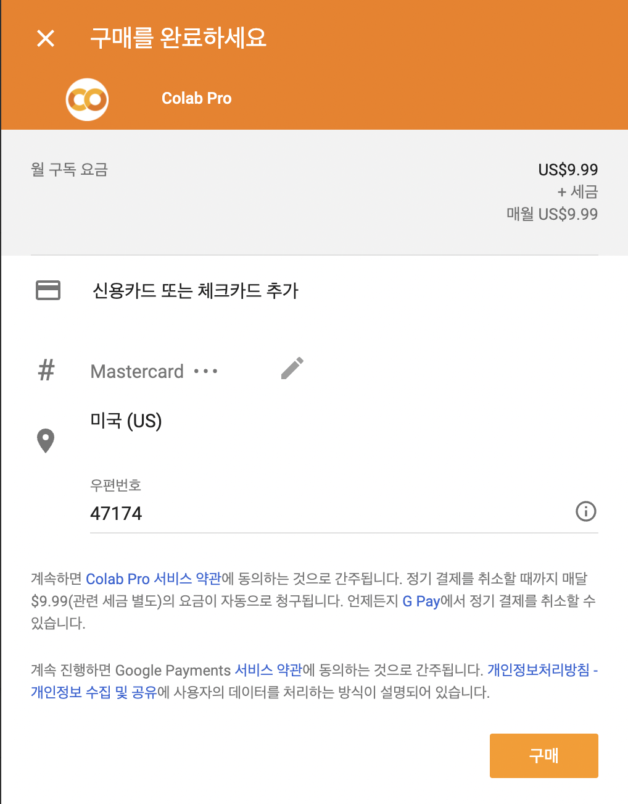
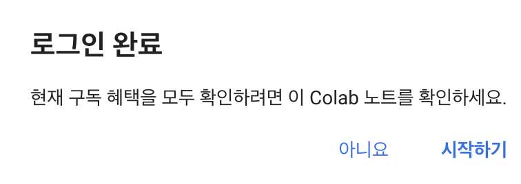

# 코랩 결제 방법

## 준비물

- 해외 결제 가능한 카드
- 구글 계정

## 결제 방법

구글 로그인 후 [https://colab.research.google.com/signup](https://colab.research.google.com/signup) 링크를 접속하면, 다음과 같이 창이 나온다.

여기서 Colab Pro 밑의 $9.99/월 버튼을 누르면, 다음 창이 나타난다.

각 창에 해외 결제 가능한 카드 정보와, 카드에 명시된 자신의 영문 이름을 입력한다.

청구소 주소 우편번호와 같은 경우 임의로 설정하면 된다. (한국이 불가능하다)

다 채우면 다음 화면에서 구매를 누른다.

모든게 잘 되면 다음 창이 나온다. 이후에는 결제한 계정으로 하면 끝이다.

